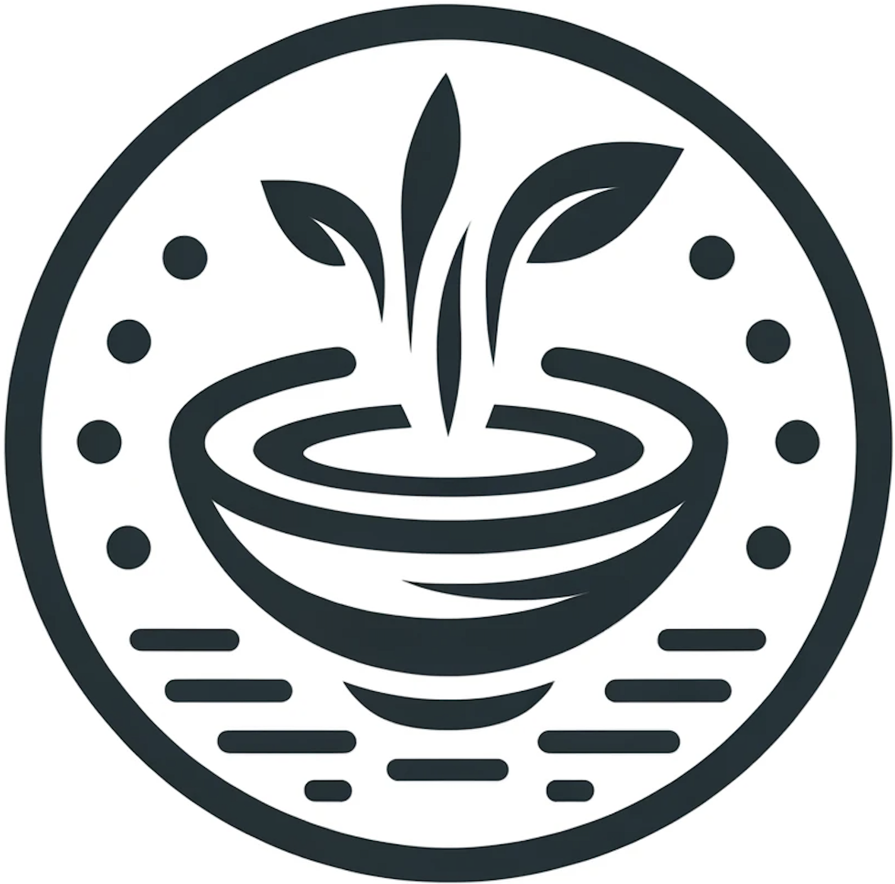
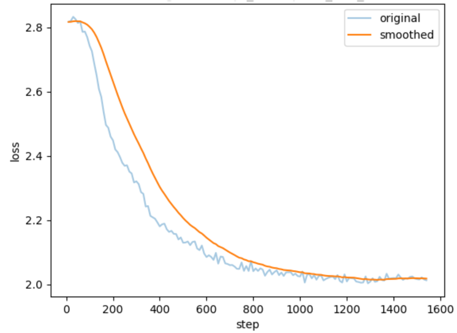

<h1 align="center">灵丹问诊中医大模型</br>ElixirQueryLLM</h1>

<div align="center">

**[中文](README_CN.md) | [English](README_EN.md)**
</div>
<div align=center></div>  

## 项目简介

本项目旨在通过在Baichuan2模型上进行继续预训练，构建一个更强大的基座模型，以支持下游任务的发展。我们特别关注于中医领域，因此选取了包括古籍、中医教材及药典等丰富的训练数据。这一过程不仅增强了模型在中医知识领域的理解能力，也为其提供了深入掌握中医理论和实践的基础。

通过本项目，我们期望大幅提升人工智能在中医领域的应用水平，为中医的现代化贡献力量。

## 更新

- [ ] 公开数据集上传
- [ ] 预训练模型上传
- [ ] 对话模型上传
- [ ] 下游任务评测
- [ ] 可视化界面

## 数据集

### 预训练数据

预训练阶段各数据源如下所示。

| 数据源                                                       | 数据格式       | 处理过程                   | Token数 |
| ------------------------------------------------------------ | -------------- | -------------------------- | ------- |
| 1522本中医古籍                                               | 非结构化txt    | 翻译为白话文               | 132M    |
| 32本中医教材                                                 | 图书格式epub等 | epub图书格式转为txt        | 8M      |
| [ChatMed_Consult](https://huggingface.co/datasets/michaelwzhu/ChatMed_Consult_Dataset), [CMtMedQA](https://huggingface.co/datasets/Suprit/CMtMedQA), <br />[QizhenGPT](https://github.com/CMKRG/QiZhenGPT/tree/main/data), [ChatMed_TCM](https://github.com/michael-wzhu/ChatMed-TCM) | 结构化Json     | 问答对话拼接，中医词表筛选 | 31M     |
| [悟道-医学问答数据](https://data.baai.ac.cn/details/WuDaoCorporaText) | 结构化Json     | 问答对话拼接，中医词表筛选 | 20M     |
| 中医医案                                                     | 结构化表格     | ChatGPT转为自然语言文本    | 7M      |
| 中成药                                                       | 结构化表格     | ChatGPT转为问答对话        | 3.6M    |
| 中草药, 西药, 院内制剂                                               | 结构化表格     | ChatGPT转为自然语言文本    | 2.5M    |
| 星斗云-中成药                                                | 结构化表格     | ChatGPT转为问答对话        | 7.2M    |
| 星斗云-中药材, 星斗云-药对                                   | 结构化表格     | ChatGPT转为自然语言文本    | 0.6M    |

#### 古籍数据《文言文翻译白话文示例》

节选自：《福寿丹书》

**原文：** 治背膊疼痛。高坐，将左右脚斜舒，两手掌按膝，行功运气十二口，日行三五次。

**白话文：** 治疗肩膀疼痛的方法。坐在高处，将双脚分开成斜角，双手手掌放在膝盖上，进行十二次的行气练功，每天进行三到五次。


**原文：** 上甘草膏，同煎为衣，能补元气，生津液，轻身延年。#服菖蒲酒#

**白话文：** 将甘草熬成膏状，与其他药材一起煎煮，可以补充元气、生津止渴，还能使人身体轻盈、延年益寿。


**原文：** 用五月五日，六月六日，七月七日，取菖蒲不拘多少，捣烂绞取清汁五斗。糯米五斗，蒸熟入细酒曲五斤（南方只用三斤），捣碎拦匀，如造酒法，下缸密盖。三七日榨起，新坛盛，泥封固。每次温服二三杯极妙。老人常服通血脉，调荣卫，聪耳明目，壮旺气力，益寿延年。#服枸杞酒#

**白话文：** 制作菖蒲酒的方法是：在五月初五、六月初六和七月初七这三天，采摘适量的菖蒲，将其捣碎并挤出清水。然后，将五斗糯米煮熟，加入五斤细酒曲（南方地区只需三斤），搅拌均匀后放入缸中，盖上盖子密封。三周后，将酒榨出，装入新坛，用泥封紧。每天温服二三杯，对老年人有很好的效果，能够疏通血脉、调整气血、增强听力、提高视力、增强体质和力量，从而延年益寿。

#### ChatGPT转为自然语言文本示例

**结构化数据如下：**

```json
{
  "药材名称": "白术",
  "性味与归经": "苦、甘，温。归脾、胃经。",
  "用法与用量": "6～12g。",
  "功能主治": "健脾益气，燥湿利水，止汗，安胎。用于脾虚食少，腹胀泄泻，痰饮眩悸，水肿，自汗，胎动不安。",
  "炮制": "白术 除去杂质，洗净，润透，切厚片，干燥。",
  "性状": "本品为不规则的肥厚团块，长3～13cm，直径1.5～7cm。表面灰黄色或灰棕色，有瘤状突起及断续的纵皱和沟纹，并有须根痕，顶端有残留茎基和芽痕。质坚硬不易折断，断面不平坦，黄白色至淡棕色，有棕黄色的点状油室散在；烘干者断面角质样，色较深或有裂隙。气清香，味甘、微辛，嚼之略带黏性。本品呈不规则的厚片。外表皮灰黄色或灰棕色。切面黄白色至淡棕色，散生棕黄色的点状油室，木部具放射状纹理；烘干者切面角质样，色较深或有裂隙。气清香，味甘、微辛，嚼之略带黏性。本品形如白术片，表面黄棕色，偶见焦斑。略有焦香气。",
  "贮藏": "置阴凉干燥处，防蛀。",
  "类型": "药材和饮片",
  "性味": "苦、甘，温",
  "归经": "归脾、胃经",
  "五味酸苦甘辛咸": "苦、甘",
  "四气": "温",
  "用量范围": "6～12g",
  "用量最小值": "6",
  "用量最大值": "12",
  "归经": "归脾、胃经"
}
```

**自然语言文本如下：**

白术是一种常用的中药材和饮片，具有健脾益气、燥湿利水、止汗和安胎的功效。在中医学中，白术的性味为苦和甘，性质温，主要归脾、胃经。因此，它广泛用于治疗脾虚食少、腹胀泄泻、痰饮眩悸、水肿、自汗以及胎动不安等多种症状。在使用白术时，一般的用法与用量是6～12g。炮制方面，白术需要除去杂质，洗净，润透，切厚片，然后进行干燥处理。性状上，白术呈不规则的肥厚团块，长约3～13cm，直径约1.5～7cm。表面呈灰黄色或灰棕色，有瘤状突起和纵皱沟纹，还有须根痕，顶端有残留的茎基和芽痕。质地坚硬，不容易折断，断面不平坦，呈黄白色至淡棕色，散布着棕黄色的点状油室。烘干后，断面呈角质样，颜色较深或有裂隙。气味清香，味道甘、微辛，嚼之略带黏性。此外，白术还有厚片的形态，外表皮呈黄棕色，偶尔可见焦斑，略有焦香气。在贮藏方面，白术需要放置在阴凉干燥处，防止虫蛀。总体来说，白术是一种性味苦甘、温性的中药材，用量范围是6～12g，主要归脾、胃经。它具有多重功效，可以帮助健脾益气、燥湿利水、止汗和安胎。在使用时，要按照规定的用法和用量进行，以达到最佳的治疗效果。

#### ChatGPT转为问答对话示例

**结构化数据格式同上。**

**问答对话示例如下：**

```json
{
    "instruction": "感谢您的帮助！再见！",
    "input": "",
    "output": "再见！祝您身体健康！",
    "history": [
        [
            "您好，我最近感觉停食、停乳、腹胀、便秘。",
            "很抱歉听到这个。除了停食、停乳、腹胀、便秘，您还有其他症状吗？"
        ],
        [
            "是的，我还有痰盛和喘咳。",
            "感谢您的回答。根据您的症状，我建议您可以尝试一种名为一捻金的中成药来帮助缓解食滞证：大黄：100g｜炒牵牛子：200g｜槟榔：100g｜人参：100g｜朱砂：30g它们可以帮助消食导滞，祛痰通便。但是，请在使用前先咨询您的医生或药剂师。"
        ],
        [
            "好的，我会考虑的。但是我有一些担心，这些中药会不会有副作用？",
            "这是一个很好的问题。一些中药可能会有副作用，但是通常情况下，它们是安全的。如果您有任何疑虑，建议您咨询您的医生或药剂师。"
        ],
        [
            "好的，我会咨询一下的。另外，我还可以做些什么来帮助缓解我的症状？",
            "除了中药，您还可以尝试一些其他方法来缓解症状，比如多喝水、多吃蔬菜水果、适量运动等。这些方法可能会有所帮助。"
        ],
        [
            "好的，我会尝试的。谢谢您的建议！",
            "不用谢！希望您能够感觉更好。如果您有其他问题，随时与我联系。祝您早日康复！"
        ]
    ]
}
```

## 预训练

在6张80GB显存的**A100**上训练35小时。

预训练过程的Loss曲线如下所示。


<div align=left></div>  


**预训练参数设置**
~~~
model_name_or_path: Baichuan2-13B-Base
finetuning_type: lora
lora_target: W_pack
per_device_train_batch_size: 16
gradient_accumulation_steps: 4
lr_scheduler_type: cosine
learning_rate: 2e-5
num_train_epochs: 4.0
bf16: true
seed: 42
quantization_bit: 4
cutoff_len: 2048
warmup_steps: 500
~~~

## 免责声明

本项目相关资源仅供学术研究之用，严禁用于商业用途。使用涉及第三方代码的部分时，请严格遵循相应的开源协议。模型生成的内容受模型计算、随机性和量化精度损失等因素影响，本项目无法对其准确性作出保证。本项目数据集绝大部分由模型生成，即使符合某些医学事实，也不能被用作实际医学诊断的依据。对于模型输出的任何内容，本项目不承担任何法律责任，亦不对因使用相关资源和输出结果而可能产生的任何损失承担责任。

## 项目引用

本工作由北京交通大学医学智能研究所和天士力合作完成，指导老师为周雪忠教授。

如果您觉得此项目有帮助，请考虑以下列格式引用。

```tex
@misc{ElixirQueryLLM,
      title={ElixirQueryLLM}, 
      author={Rui Hua},
      year={2023},
      publisher = {GitHub},
      journal = {GitHub repository},
      howpublished = {\url{https://github.com/HuaRui0420/ElixirQueryLLM}},
}
```


## 致谢

本项目参考以下开源项目

[Baichuan2](https://github.com/baichuan-inc/Baichuan2)

[LLaMA Factory](https://github.com/hiyouga/LLaMA-Factory)

